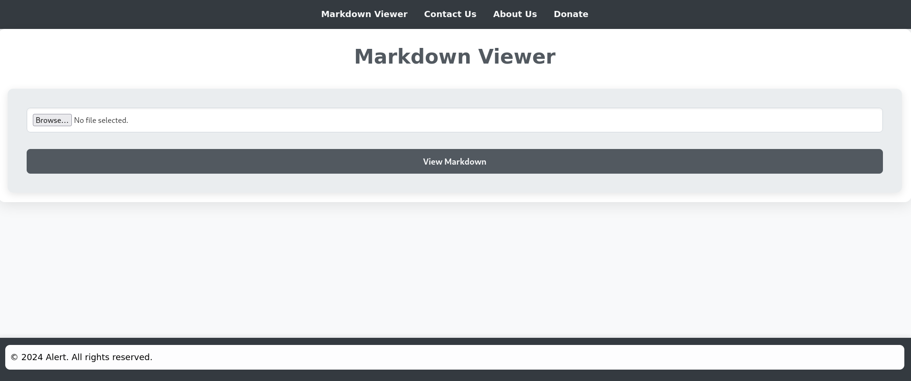
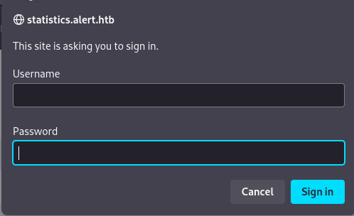

# Machine - Alert


First, lets scan the available ports to begin. `nmap -sCV -vvv -p- -T5 10.10.11.44`
 - The -p- specifies to scan all the ports including port 0.
 - -vvv is used to make a verbose response, where we can track the progress of scan.
 - -sCV is used for version detection of the services running and use default scripts for the scan.

```
PORT   STATE SERVICE REASON         VERSION
22/tcp open  ssh     syn-ack ttl 63 OpenSSH 8.2p1 Ubuntu 4ubuntu0.11 (Ubuntu Linux; protocol 2.0)
| ssh-hostkey: 
|   3072 7e:46:2c:46:6e:e6:d1:eb:2d:9d:34:25:e6:36:14:a7 (RSA)
| ssh-rsa AAAAB3NzaC1yc2EAAAADAQABAAABgQDSrBVJEKTgtUohrzoK9i67CgzqLAxnhEsPmW8hS5CFFGYikUduAcNkKsmmgQI09Q+6pa+7YHsnxcerBnW0taI//IYB5TI/LSE3yUxyk/ROkKLXPNiNGUhC6QiCj3ZTvThyHrFD9ZTxWfZKEQTcOiPs15+HRPCZepPouRtREGwmJcvDal1ix8p/2/C8X57ekouEEpIk1wzDTG5AM2/D08gXXe0TP+KYEaZEzAKM/mQUAqNTxfjc9x5rlfPYW+50kTDwtyKta57tBkkRCnnns0YRnPNtt0AH374ZkYLcqpzxwN8iTNXaeVT/dGfF4mA1uW89hSMarmiRgRh20Y1KIaInHjv9YcvSlbWz+2sz3ev725d4IExQTvDR4sfUAdysIX/q1iNpleyRgM4cvDMjxD6lEKpvQYSWVlRoJwbUUnJqnmZXboRwzRl+V3XCUaABJrA/1K1gvJfsPcU5LX303CV6LDwvLJIcgXlEbtjhkcxz7b7CS78BEW9hPifCUDGKfUs=
|   256 45:7b:20:95:ec:17:c5:b4:d8:86:50:81:e0:8c:e8:b8 (ECDSA)
| ecdsa-sha2-nistp256 AAAAE2VjZHNhLXNoYTItbmlzdHAyNTYAAAAIbmlzdHAyNTYAAABBBHYLF+puo27gFRX69GBeZJqCeHN3ps2BScsUhKoDV66yEPMOo/Sn588F/wqBnJxsPB3KSFH+kbYW2M6erFI3U5k=
|   256 cb:92:ad:6b:fc:c8:8e:5e:9f:8c:a2:69:1b:6d:d0:f7 (ED25519)
|_ssh-ed25519 AAAAC3NzaC1lZDI1NTE5AAAAIG/QUl3gapBOWCGEHplsOKe2NlWjlrb5vTTLjg6gMuGl
80/tcp open  http    syn-ack ttl 63 Apache httpd 2.4.41 ((Ubuntu))
| http-methods: 
|_  Supported Methods: HEAD POST OPTIONS
|_http-title: Did not follow redirect to http://alert.htb/
|_http-server-header: Apache/2.4.41 (Ubuntu)
Service Info: OS: Linux; CPE: cpe:/o:linux:linux_kernel
```

From the scan we can find, port 22 - ssh and port 80 - http is open.
As it has port 80 open, to access the website hoseted by the target we have to map the domain name to the ip. To do this we add the ip and the domain name which is `alert.htb` to `/etc/hosts` file.
Add `10.10.11.44	alert.htb` to the file.

Now lets open the website.

Here we can explore each tab and also view their code to get some idea, but before that lets also try to find new subdomains and directories.

To find subdomains we use `ffuf -u http://10.10.11.44 -H "Host: FUZZ.alert.htb" -w /usr/share/seclists/Discovery/DNS/subdomains-top1million-20000.txt -mc all -ac`.
- The flag -ac is used to filter only the found domains.

Once we run this we find a subdoamin `statistics.alert.htb`.
Now to access this domain we have to map it to the address just like we did for `alert.htb` in `/etc/hosts` file.
When we visit the site we get a login page.


Now lets try to explore the directories.
we use `feroxbuster -u http://alert.htb -w /usr/share/wordlists/dirbuster/directory-list-2.3-medium.txt`.

We didnt find any useful directory to work with thus, lets begin with exploring the website.
Now in the website, it allows us to upload a .md file and when we upload a file we are directed to a `http://alert.htb/visualizer.php`, Now when we click the share markdown we can see that a new page is generated. Based on this we can assume that the md file is given a random name which can be used to share the file.

To check if the .md file is being read or executed, lets add `` to the md file. When we upload the file and sharemarkdown we can see alert message, meaning the contents are accessec from the .md file we upload.
HTML is used because .md file can handle it.
